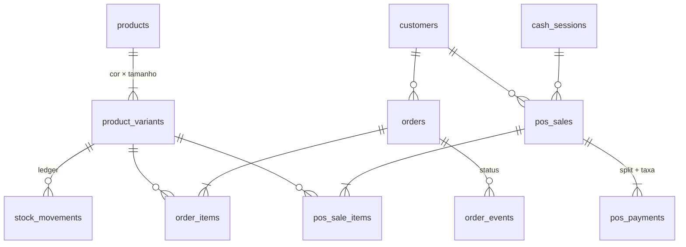
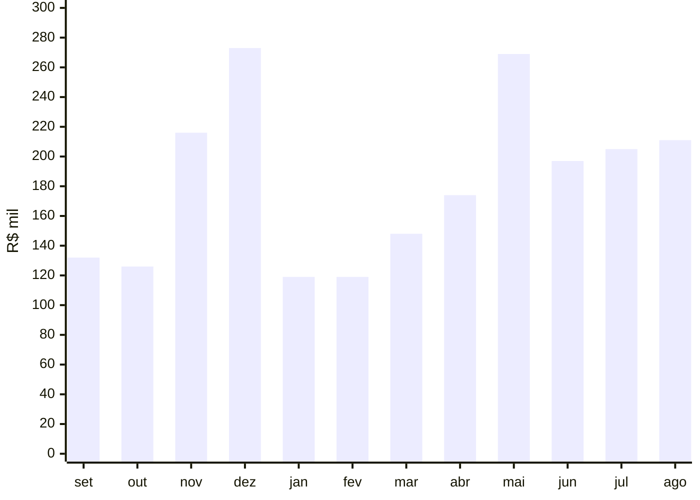

# MINE — modelagem e análise de dados para um varejo de moda omnichannel

> **Case de estudo de um projeto real.** O repositório original é **privado por preferência do cliente**. Este aqui traz o **schema de produção** (as 16 migrations PostgreSQL, sem credenciais nem identificadores), trechos da camada de consulta do app e uma **camada analítica com 13 análises SQL** que rodam sobre uma base **100% sintética**. Nenhum dado real de cliente, venda ou produto aparece neste repositório.

**Stack:** PostgreSQL (Supabase) · PL/pgSQL · SQL analítico · TypeScript / Next.js · PGlite para rodar tudo localmente

---

## Em 30 segundos

Uma loja de moda vendia em **três canais** (loja física, site e WhatsApp), mas o "banco" era só um catálogo com **preço em texto** e **estoque dentro de um JSON**. A dona não sabia quanto vendia, quanto lucrava nem quem eram as melhores clientes. E o site podia vender uma peça que já tinha saído no balcão.

Eu **redesenhei o banco de dados como fonte única da operação** e, a partir dele, construí as análises que respondem a essas perguntas:

| | |
|---|---|
| 🧱 **Modelagem** | ~25 tabelas em 6 domínios: catálogo, estoque, venda online, PDV, clientes e governança |
| 📒 **Estoque como ledger** | Todo movimento é uma linha; o saldo é consequência; a integridade é verificável por SQL |
| 🔒 **Anti-oversell** | Reserva atômica entre canais com `UPDATE` condicional, sem condição de corrida |
| 🧹 **Qualidade de dados** | Telefone → E.164, `"R$ 1.299,00"` → `129900`, deduplicação de clientes, migração de dados legados idempotente |
| 📊 **Análise** | Receita e MoM, DRE por canal, RFM, coorte de recompra, curva ABC, giro de estoque, cesta de compras |
| ✅ **Reprodutível** | `npm install && npm run tudo` sobe um Postgres em memória, aplica o schema, gera os dados e roda as 13 análises em ~5 s |

---

## Rodar localmente

Precisa só de Node.js 18+. Não precisa de Docker nem de Postgres instalado.

```bash
npm install
npm run tudo
```

O script [`scripts/rodar_tudo.mjs`](scripts/rodar_tudo.mjs):

1. sobe um **PostgreSQL 17 em memória** ([PGlite](https://pglite.dev));
2. aplica um *shim* mínimo do Supabase ([`sql/local/00_supabase_shim.sql`](sql/local/00_supabase_shim.sql)) e as **16 migrations de produção sem alteração de lógica**;
3. gera **12 meses de operação sintética** com SQL puro ([`sql/seed/seed_sintetico.sql`](sql/seed/seed_sintetico.sql)): cerca de 6.800 vendas, 2.500 clientes e 9.700 movimentos de estoque;
4. roda todas as análises e escreve os resultados em [`docs/resultados.md`](docs/resultados.md).

---

## O modelo de dados



Diagrama completo com colunas e o raciocínio por trás de cada escolha em **[docs/02-modelagem-de-dados.md](docs/02-modelagem-de-dados.md)**.

### As decisões que mais importam

<details>
<summary><b>1. Estoque é um livro-razão, não um número editável</b></summary>

Toda entrada ou saída vira uma linha em `stock_movements`. O saldo só muda por uma função que grava o movimento e o saldo **na mesma transação**, travando a linha:

```sql
select stock_on_hand + p_delta into v_new
  from product_variants
 where id = p_variant_id
   for update;                       -- serializa movimentos concorrentes

if v_new < 0 and p_reason not in ('ajuste', 'inventario') then
  raise exception 'Estoque insuficiente' using errcode = 'check_violation';
end if;

update product_variants set stock_on_hand = v_new where id = p_variant_id;
insert into stock_movements (variant_id, delta, reason, ref_type, ref_id, created_by)
values (p_variant_id, p_delta, p_reason, p_ref_type, p_ref_id, p_by);
```

E dá para **provar** que o saldo está certo:

```sql
select v.id, v.stock_on_hand, coalesce(m.total, 0) as soma_movimentos
  from product_variants v
  left join (select variant_id, sum(delta) as total
               from stock_movements group by variant_id) m on m.variant_id = v.id
 where v.stock_on_hand <> coalesce(m.total, 0);   -- esperado: 0 linhas
```
→ [`sql/schema/011_stock.sql`](sql/schema/011_stock.sql)
</details>

<details>
<summary><b>2. Reserva atômica: o site nunca vende o que saiu no balcão</b></summary>

```sql
update product_variants v
   set stock_reserved = v.stock_reserved + p_qty
 where v.id = p_variant_id
   and v.stock_on_hand - v.stock_reserved - v_safety >= p_qty;
get diagnostics v_rows = row_count;   -- 0 = não havia saldo
```

Não existe "ler o saldo, decidir e gravar" na aplicação. Reservas vencidas são liberadas por um job com `FOR UPDATE SKIP LOCKED`.
→ [`011_stock.sql`](sql/schema/011_stock.sql), [`012_orders.sql`](sql/schema/012_orders.sql)
</details>

<details>
<summary><b>3. O item de venda congela preço e custo da época</b></summary>

`order_items.cost_cents_snapshot` e `unit_price_cents` guardam os valores **do momento da venda**. Se o fornecedor reajusta amanhã, a margem de ontem não muda. É o mesmo princípio de uma tabela fato.
→ [`012_orders.sql`](sql/schema/012_orders.sql)
</details>

<details>
<summary><b>4. Uma cliente, um registro</b></summary>

```sql
normalize_phone('(11) 98888-7777')   → '5511988887777'
normalize_phone('+55 11 98888-7777') → '5511988887777'
```

`UNIQUE (whatsapp)` + `INSERT … ON CONFLICT DO UPDATE`: o site e o balcão caem na mesma ficha. Sem isso, RFM e coorte ficam errados porque a recompra aparece como cliente nova.
→ [`013_customers.sql`](sql/schema/013_customers.sql)
</details>

<details>
<summary><b>5. Migração de dados legados sem tirar o site do ar</b></summary>

Padrão *expand → migrate → contract*: colunas novas ao lado das antigas; backfill idempotente com `parse_price_cents`, `jsonb_array_elements` (JSON → linhas de variante), `unnest … WITH ORDINALITY` (ordem das fotos) e `row_number()` para desempatar slugs; trigger mantendo o formato antigo sincronizado enquanto o site ainda o lia.
→ [`009_variants.sql`](sql/schema/009_variants.sql), [`010_backfill_variantes.sql`](sql/schema/010_backfill_variantes.sql)
</details>

<details>
<summary><b>6. Segurança no banco</b></summary>

RLS em todas as tabelas; `REVOKE` explícito em views que expõem custo (views ignoram RLS); correção de funções `SECURITY DEFINER` que estavam expostas via API pública, apontada pelo linter do Supabase; `search_path` fixo; senhas com bcrypt via `pgcrypto`; anonimização (LGPD) em vez de exclusão.
→ [`016_hardening_funcoes.sql`](sql/schema/016_hardening_funcoes.sql)
</details>

Todas as decisões, no formato problema → decisão → por quê: **[docs/03-decisoes-tecnicas.md](docs/03-decisoes-tecnicas.md)**

---

## As análises

Duas views ([`00_views_analiticas.sql`](sql/analytics/00_views_analiticas.sql)) unificam o online e o balcão num grão único, com a regra de "o que conta como vendido" escrita **uma vez só**. Em cima delas:

| # | Pergunta de negócio | Técnicas SQL |
|---|---|---|
| [01](sql/analytics/01_receita_mensal_por_canal.sql) | Como a receita evolui? Quanto vem do online? | `FILTER`, `LAG`, média móvel com frame |
| [02](sql/analytics/02_dre_por_canal.sql) | Qual canal dá mais dinheiro depois de custo e taxa? | `ROLLUP`, `GROUPING` |
| [03](sql/analytics/03_rfm_segmentacao.sql) | Quem são as melhores clientes? Quem está sumindo? | RFM com `NTILE`, window sobre agregado |
| [04](sql/analytics/04_coorte_recompra.sql) | Quantas clientes voltam a comprar? | Coorte, pivot com `COUNT(DISTINCT) FILTER` |
| [05](sql/analytics/05_curva_abc_produtos.sql) | Quais produtos sustentam a loja? | Curva ABC, soma acumulada |
| [06](sql/analytics/06_giro_e_cobertura_estoque.sql) | Onde há capital parado e onde vai faltar peça? | Cobertura em dias a partir do ledger, `NULLIF` |
| [07](sql/analytics/07_mix_pagamento_e_taxas.sql) | Quanto a maquininha come do faturamento? | Participação %, taxa efetiva |
| [08](sql/analytics/08_dia_da_semana_por_canal.sql) | Em que dia cada canal vende? | `EXTRACT(isodow)`, pivot |
| [09](sql/analytics/09_cancelamento_e_lead_time.sql) | O online perde pedidos? Quanto a cliente espera? | `percentile_cont` (mediana e P90) sobre eventos |
| [10](sql/analytics/10_grade_de_tamanhos.sql) | Que grade comprar do fornecedor? | Pivot `SUM() FILTER` |
| [11](sql/analytics/11_cesta_de_compras.sql) | Quais categorias saem juntas? | Market basket: suporte, confiança e lift |
| [12](sql/analytics/12_qualidade_de_dados.sql) | Dá para confiar nesses números? | 7 checagens de integridade (todas devem dar 0) |
| [13](sql/analytics/13_funcoes_na_pratica.sql) | Dado sujo → dado canônico | Funções de limpeza do schema |

### Alguns resultados (base sintética)

**Receita mensal (R$ mil):** sazonalidade de Black Friday, Natal e Dia das Mães sobre uma tendência de alta.



**DRE por canal (12 meses):** a loja física tem a menor margem por causa da taxa de maquininha (R$ 16,5 mil no ano).

| Canal | Vendas | Receita líquida | CMV | Taxas | Margem de contribuição |
|---|---:|---:|---:|---:|---:|
| Site | 3.060 | R$ 1.076.535 | R$ 435.750 | — | **59,5%** |
| Loja | 2.394 | R$ 826.217 | R$ 346.511 | R$ 16.493 | **56,1%** |
| WhatsApp | 834 | R$ 287.001 | R$ 116.237 | — | **59,5%** |
| **Total** | **6.288** | **R$ 2.189.752** | R$ 898.499 | R$ 16.493 | **58,2%** |

**RFM:** 24% das clientes identificadas (as "Campeãs") geram **52% da receita**. Outras 128, que já foram boas clientes, estão há quase 6 meses sem comprar. É uma lista pronta para uma campanha de reativação.

| Segmento | Clientes | Recência média | Compras | % da receita |
|---|---:|---:|---:|---:|
| Campeãs | 476 | 26 dias | 6,0 | **52,2%** |
| Leais | 433 | 65 dias | 2,8 | 21,6% |
| Em risco (eram boas) | 128 | 174 dias | 2,9 | 7,8% |
| Hibernando | 516 | 239 dias | 1,0 | 9,4% |

**Estoque:** um terço do capital imobilizado (**33,5%**) está em variantes com mais de 120 dias de cobertura, enquanto 33 variantes que vendem estão zeradas.

**Qualidade:** as 7 checagens de integridade retornam **0 ocorrências**, incluindo ledger × saldo e total do pedido × itens.

Todos os resultados: **[docs/resultados.md](docs/resultados.md)** · Leitura de negócio: **[docs/04-analises-e-insights.md](docs/04-analises-e-insights.md)**

---

## Estrutura do repositório

```
├── sql/
│   ├── schema/        16 migrations de produção (higienizadas), em ordem de aplicação
│   ├── seed/          gerador de 12 meses de dados sintéticos (SQL puro, reprodutível)
│   ├── analytics/     views unificadas + 13 análises
│   └── local/         shim do Supabase para rodar em Postgres puro
├── app-excerpts/      trechos reais da camada de consulta do app (TypeScript)
├── docs/              contexto, modelagem, decisões, insights, resultados
└── scripts/           rodar_tudo.mjs — sobe o Postgres, aplica tudo e gera os resultados
```

## Sobre a confidencialidade

- O **código de produção é privado** por decisão do cliente. Autorizado pelo cliente, o nome da marca aparece aqui.
- Das migrations foram removidos o identificador do projeto Supabase e o número de contato da loja. **A lógica está intacta.**
- Não há `.env`, chaves, URLs de infraestrutura, e-mails ou dados pessoais.
- **Todos os dados são sintéticos**, gerados pelo [`seed_sintetico.sql`](sql/seed/seed_sintetico.sql). Os números acima ilustram as análises e **não representam o faturamento real** da empresa.

---

**Nicholas Belo** · Análise de Dados · [LinkedIn](https://www.linkedin.com/in/SEU-USUARIO) · [GitHub](https://github.com/nickbelo2201)
