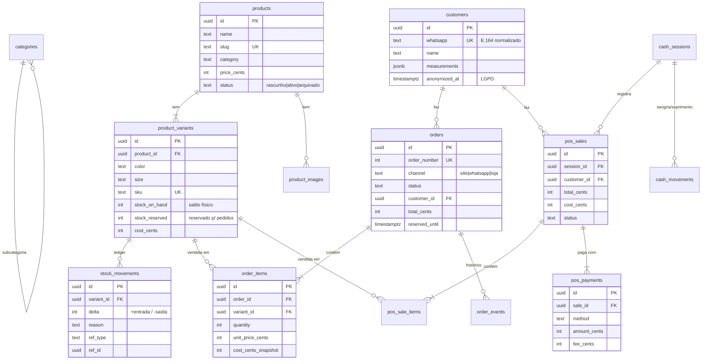

# 2. Modelagem de dados

## Diagrama entidade-relacionamento (núcleo)

Tabelas de apoio fora do diagrama: `store_settings` (configuração de linha única), `admin_users` (senha com bcrypt via `pgcrypto`), `audit_log` (antes/depois em JSONB), `banners`, `site_content` (conteúdo do site editável em JSONB), `contacts`/`messages`/`campaigns` (funil de WhatsApp) e `analytics_daily` (métricas de mídia paga).

## Domínios do modelo

| Domínio | Tabelas | Grão |
|---|---|---|
| Catálogo | `products`, `product_variants`, `product_images`, `categories` | 1 linha = 1 produto / 1 SKU |
| Estoque | `stock_movements` (+ saldo em `product_variants`) | 1 linha = 1 movimento |
| Venda online | `orders`, `order_items`, `order_events` | pedido / item / mudança de status |
| Venda de balcão | `cash_sessions`, `pos_sales`, `pos_sale_items`, `pos_payments`, `cash_movements` | caixa / venda / item / pagamento |
| Clientes | `customers` (+ view `customer_stats`) | 1 linha = 1 pessoa (por WhatsApp) |
| Governança | `admin_users`, `audit_log` | usuário / ação |
| Analítico | `vw_vendas`, `vw_itens_vendidos` | venda / item, **todos os canais** |

## Por que dois fluxos de venda separados (e uma view que junta os dois)

Um pedido online e uma venda de balcão parecem a mesma coisa, mas operam de formas diferentes:

- o **pedido online** tem ciclo longo (aguardando → confirmado → pago → enviado → entregue, ou cancelado/devolvido), frete, endereço e **reserva de estoque com prazo**;
- a **venda de balcão** nasce concluída, pertence a um **caixa**, pode ter **pagamento dividido** e paga **taxa de maquininha**.

Forçar os dois numa tabela só encheria a tabela de colunas nulas e de regras condicionais. Então o transacional fica separado, e a análise recebe uma **view unificada** (`vw_vendas`) com um grão só e as regras de "o que conta como vendido" escritas uma única vez. Detalhes em [`sql/analytics/00_views_analiticas.sql`](../sql/analytics/00_views_analiticas.sql).

## Tipos e restrições

- **Dinheiro em `int` (centavos)**, nunca `float`. `0.1 + 0.2 ≠ 0.3` em ponto flutuante, e somar milhares de vendas acumula erro.
- **`CHECK` em todo campo de domínio fechado** (status, canal, motivo de estoque, forma de pagamento), para que o banco recuse valores inválidos antes de a aplicação ver.
- **`CHECK (stock_on_hand >= 0)`**: estoque negativo é impossível por construção.
- **`UNIQUE (product_id, color, size)`**: uma variante não se repete.
- **Índice único parcial** em `stock_movements(ref_type, ref_id, variant_id, reason) WHERE ref_id IS NOT NULL`: garante idempotência, e o mesmo pedido não baixa o estoque duas vezes.
- **Índice parcial** em `orders(reserved_until) WHERE status = 'aguardando'`: o job de expiração só olha o que interessa.
- **Índice GIN** em `products.extra_categories` (array), para filtrar produtos que estão em várias categorias.
- **JSONB onde o formato varia de fato** (medidas da cliente, conteúdo do site, antes/depois da auditoria) e **colunas tipadas em todo o resto**.
